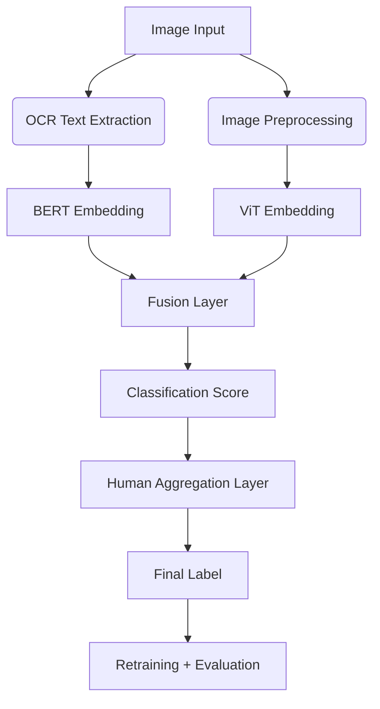

# 📚 Indic Meme Multimodal Offensive Content Classifier

### 💬 Multimodal hate speech detection in memes using BERT + Vision Transformer + Human Aggregation


---

## 🔍 Overview

Memes are powerful tools of expression but can carry offensive, culturally sensitive, or hateful messages that are hard to detect using traditional NLP or image classifiers. This project presents a **hybrid meme classification pipeline** that fuses text and image features and augments machine decisions with **human-in-the-loop scoring**.

---

## 🎯 Project Goals

* Detect offensive memes written in **Kannada + English (transliterated)**.
* Improve classification accuracy using **OCR, BERT, ViT**, and **human score aggregation**.
* Target two domains: **Sports memes** and **Celebrity memes**.

---

## 🧠 System Architecture



---

## ⚙️ Technology Stack

| Component          | Technology Used                              |
| ------------------ | -------------------------------------------- |
| Text Encoding      | `bert-base-multilingual-cased` (HuggingFace) |
| Image Encoding     | Vision Transformer (`ViT-base`)              |
| OCR                | `pytesseract` (Kannada + English)            |
| Frameworks         | PyTorch, TorchVision, Transformers           |
| Environment        | Google Colab with GPU                        |
| Evaluation Metrics | Accuracy, F1 Score, Precision, Recall        |

---

## 🧪 Methodology

1. **OCR + Preprocessing**:

   * Extract meme text using `pytesseract`.
   * Clean using RegEx; preserve offensive cues (`#`, `@`, `!`, etc.).

2. **Multimodal Feature Extraction**:

   * BERT: 768-dim textual embedding.
   * ViT: 768-dim visual embedding.

3. **Fusion Layer**:

   * Concatenate → Normalize → Dense → ReLU → Dropout → Sigmoid.

4. **Human Aggregation**:

   * Final score = `0.7 * model_score + 0.3 * human_label`
   * Threshold at 0.5 → label as offensive or not.

5. **Retraining**:

   * Train again using aggregated labels to boost performance.

---

## 📊 Results

| Domain          | Model-Only Accuracy | After Human Aggregation | Final Voting Accuracy |
| --------------- | ------------------- | ----------------------- | --------------------- |
| Sports Memes    | 66–69%              | **84.7%**               | **97.7%**             |
| Celebrity Memes | 62–64%              | **81.3%**               | **97.7%**             |

---

## 📁 Dataset

* Collected 850 memes from platforms like Instagram, X, Facebook.
* Labeled manually into:

  * `Offensive`
  * `Non-Offensive`
* Stored in `.zip` folders for ingestion.

---

## 📌 Key Highlights

* Human-in-the-loop improved edge-case accuracy.
* Strong generalization despite limited dataset.
* Achieved F1 Score of **0.97** after hybrid retraining.
* System adapts well to sarcasm, coded language, and cultural context.

---

## 📦 How to Run

```bash
# Clone this repository
git clone https://github.com/your-username/meme-offensive-classifier.git

# Install dependencies
pip install torch torchvision transformers pytesseract sklearn

# Run main pipeline
python multimodal_classifier.py --data_path ./data/ --aggregate_labels True
```

> Note: This repo is implemented on Google Colab. Adjust file paths and image loading as needed for local or cloud environments.

---

## 📄 License

This project is for educational and research purposes only. No real-world deployment has been conducted for public moderation use.

---

## 🤝 Acknowledgements

* Hateful Memes Challenge (Kiela et al.)
* BERT, Vision Transformer, and HuggingFace community
* DravidianLangTech workshop datasets

---

